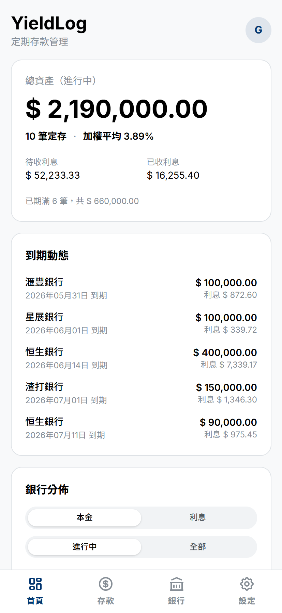
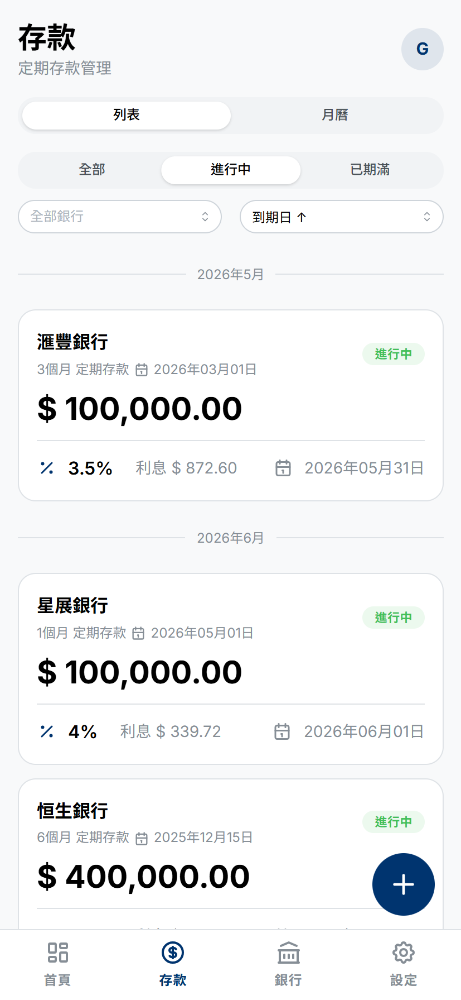
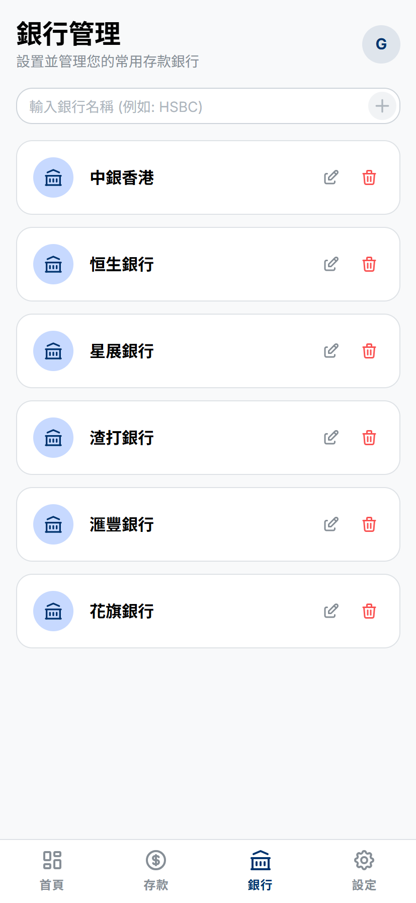
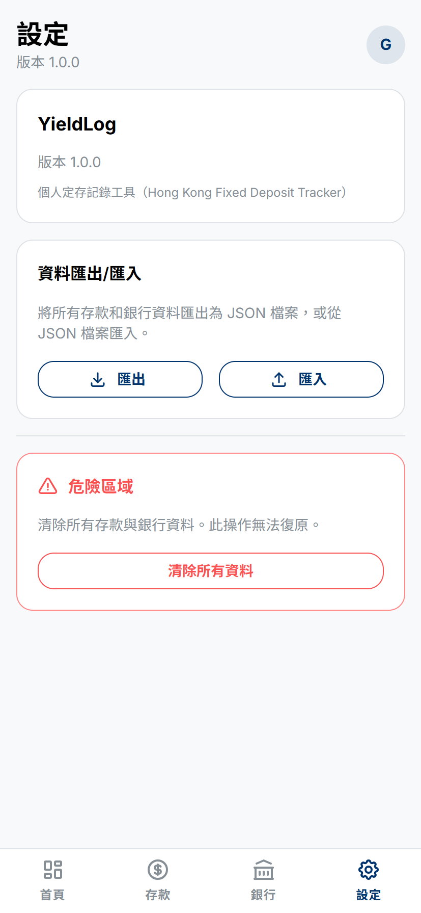
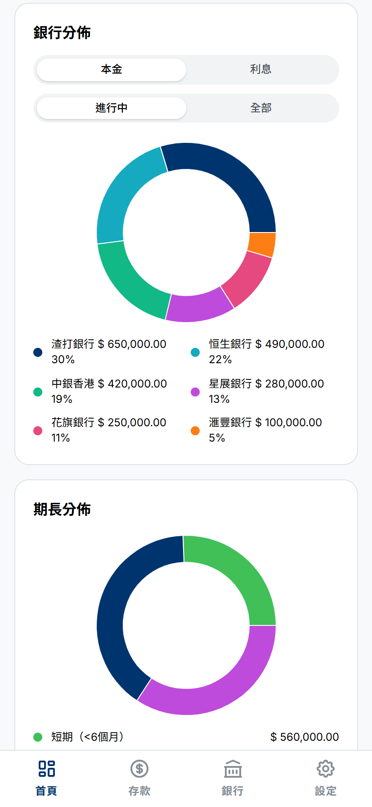
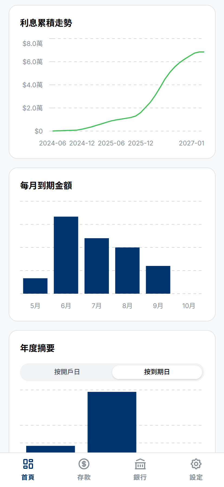
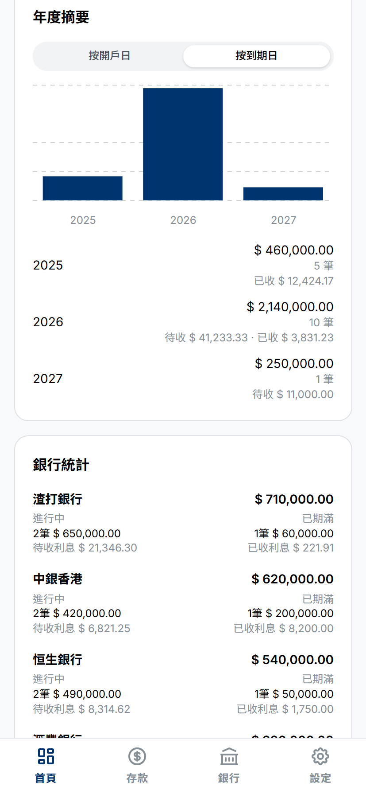

# YieldLog

個人定存記錄工具（Hong Kong Fixed Deposit Tracker）— 追蹤管理銀行定期存款，繁體中文介面，港幣結算。

> **Demo**: [yieldlog.netlify.app](https://yieldlog.netlify.app/) — 使用訪客帳戶 `guest@example.com` / `guest` 登入（唯讀）。

## 畫面預覽

### 儀表板



### 新增存款



### 銀行管理



### 設定



### 統計圖表







## 功能

- **用戶認證** — Supabase Auth（Email/密碼）
- **銀行管理** — 自訂銀行清單，下拉選擇
- **定存記錄** — 金額、期限、利率、利息 auto-calc（可調整）
- **到期管理** — 到期日 auto-calc（可調整），自動標記已期滿
- **儀表板**
  - 即時摘要卡（總資產、待收/已收利息、加權平均利率）
  - 銀行分佈（本金/利息、進行中/全部，自選檢視）
  - 期長分佈（短/中/長期比例）
  - 利息累積走勢（歷史 + 預期）
  - 每月到期金額圖表
  - 到期動態（即將到期 + 7日內期滿）
  - 年度摘要
  - 銀行統計
- **訪客帳戶** — 瀏覽不限瀏覽，唯讀不可修改
- **PWA** — 可安裝至手機主畫面

## 技術棧

| 層級 | 技術                                |
| ---- | ----------------------------------- |
| 框架 | VitePlus + React 19 + TypeScript    |
| UI   | Mantine UI v7 + Recharts            |
| 狀態 | Zustand                             |
| 後端 | Supabase（PostgreSQL + Auth + RLS） |
| PWA  | vite-plugin-pwa                     |
| 日期 | dayjs                               |

## 開始

### 前置需求

- Node.js >= 18
- npm >= 11
- [Supabase](https://supabase.com) 專案

### 安裝

```bash
npm install
```

### 環境變數

```bash
cp .env.example .env
```

在 `.env` 填入 Supabase 專案的 URL 和 Anon Key。

### 資料庫設定

1. 前往 Supabase Dashboard → **SQL Editor**
2. 將 `supabase/schema.sql` 全部貼上並執行
3. 前往 **Authentication → Settings** → 關閉 **Confirm email**
4. 前往 **Authentication → Settings** → **User Signups** → 關閉 **Allow new user sign-ups**
5. （可選）執行 `supabase/seed.sql` 填入範例資料

### 訪客帳戶設定

如需啟用訪客唯讀帳戶（guest@example.com / guest），請在 Supabase 建立該帳戶後執行以下 SQL：

1. 前往 Supabase Dashboard → **Authentication → Users** → **Add User**
2. 填入電郵 `guest@example.com`、密碼 `guest`，取消勾選 **Confirm email**
3. 前往 **SQL Editor**，執行：

```sql
UPDATE auth.users
SET
  raw_user_meta_data = raw_user_meta_data - 'is_guest',
  raw_app_meta_data = COALESCE(raw_app_meta_data, '{}'::jsonb) || '{"is_guest": true}'::jsonb
WHERE email = 'guest@example.com';
```

### 啟動

```bash
vp dev
```

## 使用

1. 註冊帳戶（預設不開放公開註冊，自行部署請自行啟用）
2. 新增定存 — 點擊右下角 FAB（+），填寫銀行、金額、期限、利率
3. 自動計算 — 系統自動算利息和到期日，可手動修改
4. 儀表板 — 檢視多種圖表與統計
5. 銀行管理 — 新增/編輯/刪除銀行名稱

## 架構

```
Pages:    Login → Register → Dashboard → DepositForm → BankManagement
                                 ↕            ↕              ↕
Stores:   useAuthStore ←── useBanksStore ←── useDepositsStore
                                 ↕              ↕
Lib:                         supabase client
```

## 資料模型

### banks

| 欄位       | 型別      | 說明            |
| ---------- | --------- | --------------- |
| id         | uuid      | 主鍵            |
| user_id    | uuid (FK) | 關聯 auth.users |
| name       | text      | 銀行名稱        |
| created_at | timestamp | 建立時間        |

### fixed_deposits

| 欄位          | 型別      | 說明                            |
| ------------- | --------- | ------------------------------- |
| id            | uuid      | 主鍵                            |
| user_id       | uuid (FK) | 關聯 auth.users                 |
| bank_id       | uuid (FK) | 關聯 banks                      |
| amount        | numeric   | 存款金額                        |
| period_value  | integer   | 期限數值                        |
| period_unit   | text      | 單位（days/weeks/months/years） |
| interest_rate | numeric   | 年利率                          |
| interest      | numeric   | 利息（可修改）                  |
| start_date    | date      | 起息日                          |
| end_date      | date      | 到期日（可修改）                |
| created_at    | timestamp | 建立時間                        |

## License

MIT
